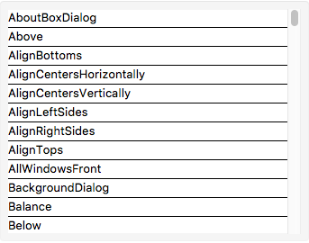

<a id="currentvalue-and-frontendtokens" style="width:0;height:0;margin:0;padding:0;">&zwnj;</a>

## CurrentValue and FrontEndTokens

As mentioned briefly under  ```Highly Useful Functionality ▸ Kernels and Remote Computations```  Mathematica has a device called a  ```FrontEndToken```  for accessing front end methods and information.

### FrontEndToken

In general, how this is structured is the following:

	FrontEndToken[token_String]

or

	FrontEndToken[feobject_,token_String]

And then the front end is actually accessed via  ```FrontEndExecute``` . We can use this to, say, copy the previous cell as plaintext and paste it:

	SelectionMove[PreviousCell@PreviousCell[],All,Cell];
	FrontEndTokenExecute["CopySpecial","Text"];
	SelectionMove[EvaluationCell[],After,Cell];
	FrontEndTokenExecute["Paste"];

Via front end tokens, it’s possible to do pretty much everything the front end can. A somewhat exhaustive list of them is presented below:

	(*Out:*)
	


Each button in that list executes  ```FrontEndTokenExecute[token]```  so test them out for yourself. Beware that many might be dangerous.

You may know or recall that there are a series of event specifications that can be passed to  ```EventHandler``` ,  ```CellEventActions``` ,  ```NotebookEventActions``` , and  ```FrontEndEventActions``` . There are a number of documented event specifications, but there is one critical class of these that is missing. It looks like this:

	{"MenuCommand",token_}

This catches the front end event called by  ```FrontEndTokenExecute[token]``` . Among the many uses of this, it can be used for changing the way an  ```InputField```  evaluates using the  ```"HandleShiftReturn"```  token:

	validationFunction[variable_]:=
	 (variable=StringReplace[variable,Except[DigitCharacter]->""]);
	validationFunction~SetAttributes~HoldFirst;
	InputField[Dynamic[var],String]~EventHandler~{ {"MenuCommand","HandleShiftReturn"}:>validationFunction[var]}

Now whenever you press  ```+``` ,  ```validationFunction```  is applied. This is useful if you don’t want to put your side-effects as the second argument to  ```Dynamic``` .

This can also be used to make notebooks with custom actions, for, say, a save event:

	CreateDocument[{
	  Cell["","TopBarCell"],
	  Cell["Try saving this notebook","Text"]},
	 NotebookEventActions{
	  {"MenuCommand","Save"}
	  FrontEndExecute@
	  FrontEnd`AttachCell[
	   First@Cells[],
	   Cell[TextData[{"Notebook cannot be saved via the front end. Try ",ToBoxes@Unevaluated@Style[NotebookSave[],"Input"]}],"Text",FontColorRed],
	   {Automatic,{Left,Bottom} },
	   {Left,Top},
	   "ClosingActions"{"OutsideMouseClick"}
	   ],
	  {"MenuCommand","SaveRename"}
	  FrontEndExecute@
	  FrontEnd`AttachCell[
	   First@Cells[],
	   Cell[TextData[{"Notebook cannot be deleted via the front end. Try ",ToBoxes@Unevaluated@Style[NotebookClose[],"Input"]}],"Text",FontColorRed],
	   {Automatic,{Left,Bottom} },
	   {Left,Top},
	   "ClosingActions"{"OutsideMouseClick"}
	   ]
	  },
	 StyleDefinitions
	 Notebook[{
	   Cell[StyleData[StyleDefinitions"Default.nb"]],
	   Cell[StyleData["TopBarCell"],
	    CellMargins{ {0, 0}, {15, 0} },
	    CellFrame{ {0,0},{2,0} },
	    "CellFrameStyle"GrayLevel[.8],
	    BackgroundGrayLevel[.9]
	    ]
	   }],
	 WindowSize{500,400}]

### CurrentValue

In many ways,  ```CurrentValue```  is just a wrapper to  ```Options``` ,  ```SetOptions``` , and  ```FrontEndToken```  but this makes it powerful.

For instance, we can use it to query style options:

	CurrentValue@{"StyleDefinitions","Section","Background"}

	(*Out:*)
	


Figure out what the current selection in a notebook is (restricted to content):

	SelectionMove[EvaluationCell[],All,CellContents];
	CurrentValue@"SelectionData"

	(*Out:*)
	
	RowBox[{RowBox[{RowBox[{"SelectionMove","[",RowBox[{RowBox[{"EvaluationCell","[","]"}],",","All",",","CellContents"}],"]"}],";"}],"",RowBox[{"CurrentValue","@","\"SelectionData\""}]}]

And determine whether a modifier key is pressed or not:

	Dynamic@CurrentValue["ShiftKey"]

It can also be used to set options:

	CurrentValue[EvaluationCell[],"Background"]=RandomColor[];
	Pause[.5];
	CurrentValue[EvaluationCell[],"Background"]=None;