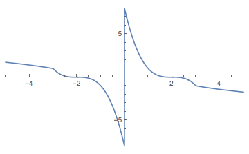
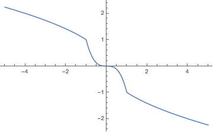
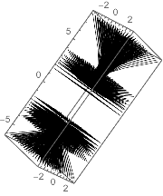
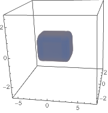
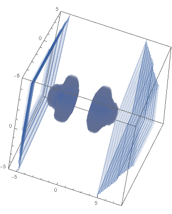
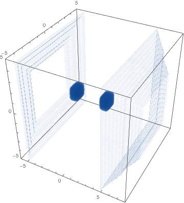
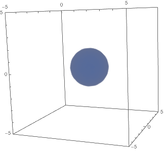

<a id="fixedpoint-and-gradients" style="width:0;height:0;margin:0;padding:0;">&zwnj;</a>

## FixedPoint and Gradients

### Why is this here

While not tightly intertwined with all aspects of functional programming, this does provide an example of the simplicity with which we can do interesting tasks using functional programming.

Using a more procedural paradigm each portion of this code (outside of the basic gradient definitions) would be more involved, more error prone, and also less efficient.

### FixedPoint and Gradients

Just as a side note there is a function called  ```FixedPoint```  that is essentially  ```Nest```  until the result doesn’t change. This is great for following gradients to minima. We can use its corresponding  ```FixedPointList```  to trace an arbitrary gradient. For now we’ll use a gradient with a predictable result:

	gradient=
	Compile[{ {pos,_Real,1} },
	 {
	  Piecewise[{
	    {Sqrt@-(#+2),#<-3},
	    {(-(#+2)^3),-3<#<0},
	    {-((#-2)^3),0≤#<3},
	    {-Sqrt@(#-2),3<=#}
	    },#]&@pos[[1]],
	  Piecewise[{
	    {Sqrt@-(#),#<-1},
	    {(-(#)^3),-1<=#<=1},
	    {-Sqrt@(#),1<=#}
	    },#]&@pos[[2]],
	  Piecewise[{
	    {Sqrt@-(#),#<-1},
	    {(-(#)^3),-1<=#<=1},
	    {-Sqrt@(#),1<=#}
	    },#]&@pos[[3]]
	  }
	 ];

	Plot[First@gradient@{x,x,x},{x,-5,5}]

	(*Out:*)
	


	Plot[Last@gradient@{x,x,x},{x,-5,5}]

	(*Out:*)
	


Essentially our system should be pushed to either  ```{2,0,0}```  or  ```{-2,0,0}```

Then we’ll calculate the path a point travels along (we’ll apply a much rougher sameness test that  ```FixedPoint```  usually takes):

	(path=
	 FixedPointList[
	  gradient@#+#&,
	   {5,2,2},
	  SameTest(Norm@Abs[#-#2]<.0001&)])//AbsoluteTiming//First

	(*Out:*)
	
	0.001503`

And we can plot this:

	Graphics3D[Arrow@Tube[path],AxesTrue,ImageSizeSmall]

	(*Out:*)
	


Then we can do this for many paths. First we’ll calculate a grid across the cube  ```{ {-5,-5,-5},{5,5,5} }```  with 20 divisions on per direction:

	gridPoints=
	Tuples[Subdivide[-5,5,20],3];

Then we’ll compute the paths traveled (note how quickly this can be computed using  ```FixedPoint``` ):

	(paths= 
	 Table[
	  FixedPointList[
	   gradient@#+#&,
	   p,
	   SameTest(Norm@Abs[#-#2]<.1&)
	   ][[2;;]],
	  {p,gridPoints}
	  ])//AbsoluteTiming//First

	(*Out:*)
	
	0.213083`

We’ll plot the paths followed:

	Graphics3D[Line/@paths,AxesTrue,ImageSizeSmall]

	(*Out:*)
	


Note the central gap where the gradient sampled out the points immediately. We can visualize this by simply showing the first step for a central cube:

	Arrow@{#,#+gradient@#}&/@Tuples[Subdivide[-1,1,3],3]//Graphics3D[#,
	 ImageSizeSmall,
	 PlotRange{Automatic,{-2,2},{-2,2} },
	 AxesTrue,
	 AxesOrigin{0,0,0}]&

	(*Out:*)
	


Then we’ll create a density map for these points based on the norm of the gradient at a each point along the paths:

	pds=Append[#,Norm@*gradient@#]&/@DeleteDuplicates@Flatten[paths,1];

	densityData=
	With[{r=Last/@pds//MinMax},
	 ReplacePart[#,4->Rescale[Last@#,r]]&/@pds
	 ];

then use the magical  ```ListDensityPlot3D```  to get a density plot of this:

	ListDensityPlot3D[densityData,
	 OpacityFunction(If[#<.25,1-#,0]&),
	 ImageSizeSmall]

	(*Out:*)
	


Note that we don’t see two wells because Mathematica interpolates between the two well pieces. We can change this by simply adding our grid points back in:

	pdsNew=Join[pds,Append[#,Norm@gradient@#]&/@gridPoints,1];

	densityDataNew=
	With[{r=Last/@pdsNew//MinMax},
	 ReplacePart[#,4->Rescale[Last@#,r]]&/@pdsNew
	 ];

	ListDensityPlot3D[densityDataNew,
	 OpacityFunction(If[#<.2,1-#,0]&)
	 ]

	(*Out:*)
	


Note the application of  ```OpacityFunction```  to drop those bits of data with norms above the 20% mark. The rings are, of course, just coming from our grid points.

And of course we can functionalize this:

	Options[gradientDensityPlot]=Options@ListDensityPlot3D;
	gradientDensityPlot[grad_,
	 startPoints:{ {_?NumericQ,_?NumericQ,_?NumericQ},__List},
	 cutoff:_?NumericQ:.2,
	 ops:OptionsPattern[]
	 ]:=
	With[{
	  pathData=
	  With[{o=
	    Sequence@@
	    FilterRules[
	     {ops,
	      SameTest->(Norm@Abs[#1-#2]<.1&)
	      },
	     Options@FixedPointList]},
	   Join@@Map[
	    FixedPointList[grad@#+#&,#,o]&,
	    startPoints]
	   ]
	  },
	 With[{
	   gradData=
	   Append[#,Norm@grad@#]&/@DeleteDuplicates@Join[pathData,startPoints]
	   },
	  ListDensityPlot3D[
	   With[{r=MinMax@gradData},
	    ReplacePart[#,
	     -1->Rescale[Last@#,r]]&/@gradData
	    ],
	   FilterRules[
	    {ops,
	     OpacityFunction->(If[#<cutoff,1-#,0]&)
	     },
	    Options@ListDensityPlot3D]
	   ]
	  ]
	 ];

By judicious use of  ```RegionFunction```  and a density cutoff we can focus in on the places we are interested in:

	gradientDensityPlot[gradient,gridPoints,
	 .05,
	 SameTest->(Norm@Abs[#1 - #2 ]<.01 &)
	 ]

	(*Out:*)
	


Now let’s try it on another gradient!

We’ll just use a linear gradient, pushing everything into zero:

	gradientDensityPlot[-#/2&,N@gridPoints]

	(*Out:*)
	
