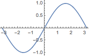
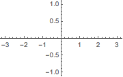
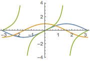
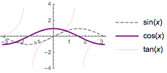
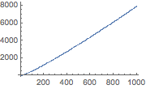
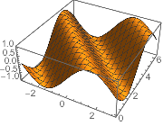
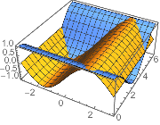
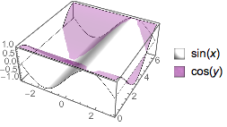

<a id="plotting" style="width:0;height:0;margin:0;padding:0;">&zwnj;</a>

## Plotting

Mathematica has a host of different plot functions, but usually one only needs three of them:

### Plot

```Plot```  takes a function as its first argument and a variable and range as its second one. Example:

	Plot[Sin[x], {x, -π, π},
	 ImageSize -> Small]

	(*Out:*)
	


The function can also be defined outside of the  ```Plot```  function itself:

	sinx = Sin[x];
	Plot[sinx, {x, -π, π},
	 ImageSize -> Small]

	(*Out:*)
	


User defined functions are also valid, but they must first be called on the variable one wants to use.

That’s why the following fails:

	mySin[x_] := Sin[x];
	Plot[mySin, {x, -π, π},
	 ImageSize -> Small]

	(*Out:*)
	


But the following will work:

	mySin[x_] := Sin[x];
	Plot[mySin[x], {x, -π, π},
	 ImageSize -> Small]

	(*Out:*)
	


```Plot```  can also plot many functions simultaneously, if the first argument is a list of appropriate functions:

	Plot[{Sin[x], Cos[x], Tan[x]}, {x, -π, π},
	 ImageSize -> Small]

	(*Out:*)
	


These functions can be distinguished from each other via legends and styling. For example:

	Plot[{Sin[x], Cos[x], Tan[x]}, {x, -π, π},
	 PlotLegends -> "Expressions",
	 PlotStyle -> {
	   Directive[Dashed, Gray],
	   Directive[Thick, Purple],
	   Directive[Thin, Red]
	   },
	 ImageSize -> Small
	 ]

	(*Out:*)
	


### ListPlot

```ListPlot```  is a variant of  ```Plot```  that just takes a list of values and plots them. For example, let’s plot the first 1000 primes. The function we’re using here,  ```Table``` , is explained more in the next section.

	ListPlot[Table[Prime[n], {n, 1000}],
	 ImageSize -> Small]

	(*Out:*)
	


Similarly to  ```Plot``` , we can plot multiple data sets:

	ListPlot[{
	  Table[Prime[n], {n, Range[2, 1000, 2]}],
	  Table[-Prime[n], {n, Range[1, 999, 2]}]},
	 ImageSize -> Small]

	(*Out:*)
	


And again we can apply styling rules:

<pre >
<code>
ListPlot[{
  Table[Prime[n], {n, Range[2, 1000, 2]}],
  Table[-Prime[n], {n, Range[1, 999, 2]}]},
 PlotLegends -> {"prime<sub>n</sub> for \
n=2,4,6,...,1000",
   "-prime<sub>n</sub> for n=1,3,5,...,999"},
 PlotStyle -> {Directive[AbsolutePointSize[5], Red], 
   Directive[AbsolutePointSize[.1], Purple]},
 ImageSize -> Small
 ]
</code>
</pre>

	(*Out:*)
	


We can also join the points to plot out a line

<pre >
<code>
ListPlot[{
  Table[Prime[n], {n, Range[2, 1000, 2]}],
  Table[-Prime[n], {n, Range[1, 999, 2]}]},
 PlotLegends -> {"prime<sub>n</sub> for \
n=2,4,6,...,1000",
   "-prime<sub>n</sub> for n=1,3,5,...,999"},
 PlotStyle -> {Directive[Dashed, Red], Directive[Thick, Purple]},
 Joined -> True,
 ImageSize -> Small
 ]
</code>
</pre>

	(*Out:*)
	


### Plot3D

```Plot3D```  works just like  ```Plot``` , but takes two ranges

	Plot3D[Sin[x + y], {x, -π, π}, {y, 0, 2 π},
	 ImageSize -> Small]

	(*Out:*)
	


Multiple functions:

	Plot3D[{Sin[x], Cos[y]}, {x, -π, π}, {y, 0, 2 π},
	 ImageSize -> Small]

	(*Out:*)
	


Styling:

	Plot3D[{Sin[x], Cos[y]}, {x, -π, π}, {y, 0, 2 π},
	 PlotLegends -> "Expressions",
	 MeshStyle -> None,
	 PlotStyle -> {
	   Directive[Specularity[Gray, 10], White],
	   Directive[Purple, Specularity[Gray, 100], Opacity[.3]]},
	 Lighting -> "Neutral",
	 ImageSize -> Small]

	(*Out:*)
	


### Special Plots

Mathematica, being the massive system it is, has more-or-less every plot type one could desire built in. Most of these will not be generally useful, but it is worth keeping in mind that any plot type one could want, like, say, a 3D point-wise density-estimating plot, Mathematica has it. See:  ```ListDensityPlot3D``` .

That specific plot will be useful later in finding local sinks from gradient functions and is not the kind of run-of-the-mill plot one sees everywhere.