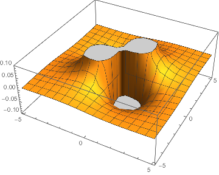
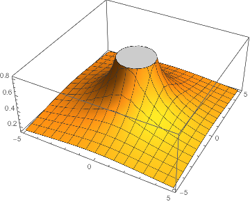

<a id="calculus" style="width:0;height:0;margin:0;padding:0;">&zwnj;</a>

## Calculus

Mathematica is useful for many types of mathematical operations, but of particular use are derivatives and integrals.

### Derivatives

Derivatives can be taken using either the function  ```D```  or the alias pd.

For example, to take the first derivative of  x<sup>2</sup>  one can use either of the following:

	D[x^2, x]

	(*Out:*)
	
	2 x

or

<code>
∂<sub>x</sub>x^2
</code>

	(*Out:*)
	
	2 x

A derivative can be taken of a derivative:

<code>
∂<sub>x</sub>∂<sub>x</sub>x^2
</code>

	(*Out:*)
	
	2

But this is equivalent to a simple second derivative which Mathematica can also do:

	D[x^2, {x, 2}]

	(*Out:*)
	
	2

or

<code>
∂<sub>x,x</sub>x^2
</code>

	(*Out:*)
	
	2

We can also take derivatives in multiple variables:

<code>
∂<sub>x,y</sub>
</code>

(3 x y)/(x^2+y^2)^(5/2)

And then for fun let’s plot this:

	dxy = \!\(
	\*SubscriptBox[\(∂\), \(x, y\)]
	\*FractionBox[\(1\), 
	SqrtBox[\(
	\*SuperscriptBox[\(x\), \(2\)] + 
	\*SuperscriptBox[\(y\), \(2\)]\)]]\);
	Plot3D[dxy, {x, -5, 5}, {y, -5, 5}]

	(*Out:*)
	


### Integration

Mathematica also knows how to do more integrals than any chemist is likely to need. The function for integration is  ```Integrate```  although like with derivatives there is an alias via intt for indefinite integrals and dintt for definite integrals

Examples:

	Integrate[2, x]

	(*Out:*)
	
	2 x

	∫2 x

	(*Out:*)
	
	2 x

And just to show that Mathematica observes the fundamental theorem of calculus like the rest of us:

	∫∫dxy x y

1/Sqrt[x^2+y^2]

And we’ll plot this guy too:

	reversedxy = ∫∫dxy x
	y;
	Plot3D[reversedxy, {x, -5, 5}, {y, -5, 5}]

	(*Out:*)
	


### Fun examples:

Mathematica is a great calculus tool and it knows many types of interesting functions so we’ll have it integrate the following very nasty function for us:

```Subscript[P, 3](cos(θ)) cot(θ) d/dθ Subscript[P, 
  4](cos(θ))```  where  ```Subscript[P, i](cos(θ))```  is the ith Legendre polynomial in cos(θ), which is to say, a nasty polynomial with a lot of trigonometric functions which is very difficult to integrate.

	Integrate[
	 LegendreP[3, Cos[θ]] Cot[θ] D[
	   LegendreP[4, Cos[θ]], θ], {θ, 0, π}]

	(*Out:*)
	
	0

but Mathematica has absolutely no problem evaluating this integral. It can even tell you that switching the derivative and cot terms makes the integral impossible to evaluate.

	Integrate[
	 LegendreP[3, Cos[θ]] D[
	   Cot[θ] LegendreP[4, Cos[θ]], θ], {θ, 
	  0, π}]

<code>
∫<sub>0</sub><sup>π</sup> (-3 Cos[θ]+5 Cos[θ]<sup>3</sup>) (- (3-30 Cos[θ]<sup>2</sup>+35 Cos[θ]<sup>4</sup>) Csc[θ]<sup>2</sup>+ Cot[θ] (60 Cos[θ] Sin[θ]-140 Cos[θ]<sup>3</sup> Sin[θ]))θ
</code>

And when it sees that it simply returns the integration expression.